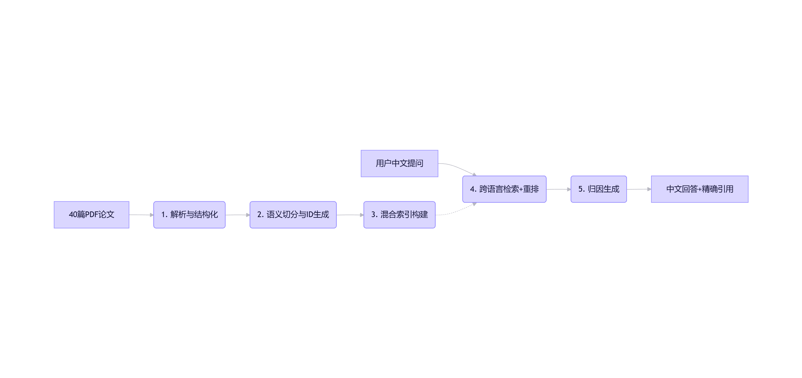

RAG问答系统架构

所以分为两步工作， 

第一步是提问前， 先把论文全部信息分块， 用embedding模型把信息变成向量， 存到向量库， 

第二步是提问后， 先把问题用同一个embedding模型变成向量， 再与向量库中的向量进行检索得到top-k个， 再调用工具进行重排得到top-k, 最后把问题的embedding和重排后的embedding参考文档一并输入给大模型, 再输出大模型的回答结果

---

技术栈

| 阶段         | 组件          | 技术选型                           |
| ---------- | ----------- | ------------------------------ |
| 1. 文档加载与解析 | PDF提取       | Marker                         |
| 2. 文本分块    | 文本分块        | tiktoken                       |
| 3. 向量化     | Embedding模型 | BGE-M3                         |
|            | 批量处理        | SentenceTransformer.encode()   |
| 4. 向量存储    | 向量数据库       | ChromaDB                       |
|            | 索引类型        | HNSW                           |
| 5. 检索      | 向量检索        | ChromaDB.similarity\_search()  |
|            | 检索框架        | LlamaIndex Retriever           |
| 6. 重排序     | 重排序模型       | BGE-Reranker-v2-m3             |
|            | 重排序策略       | Cross-Encoder                  |
| 7. 提示构建    | Prompt模板    | LangChain PromptTemplate       |
|            | 上下文压缩       | ContextualCompressionRetriever |
| 8. 生成      | 本地LLM       | Qwen-7B/14B                    |
|            | 云API        | OpenAI GPT-4                   |
|            | 生成框架        | LangChain LLMChain             |
| 9. 后处理     | 引用格式化       | 自定义函数                          |
|            | 结果缓存        | Redis                          |

---

chunk\_id 

- chunk\_id是**数据分片的唯一标识符**
- chunk\_id **完全由你的 ETL 流水线生成**，通常发生在“PDF → Markdown → Chunk”这一步

---