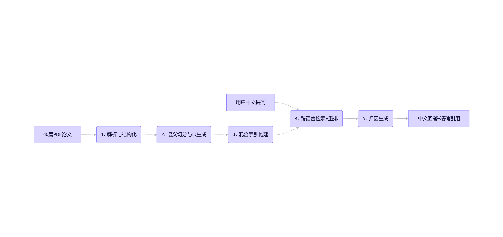

RAG问答系统架构

所以分为两步工作， 

第一步是提问前， 先把论文全部信息分块， 用embedding模型把信息变成向量， 存到向量库， 

第二步是提问后， 先把问题用同一个embedding模型变成向量， 再与向量库中的向量进行检索得到top-k个， 再调用工具进行重排得到top-k, 最后把问题的embedding和重排后的embedding参考文档一并输入给大模型, 再输出大模型的回答结果

---

技术栈

| 阶段         | 组件          | 技术选型                           |
| ---------- | ----------- | ------------------------------ |
| 1. 文档加载与解析 | PDF提取       | Marker                         |
| 2. 文本分块    | 文本分块        | tiktoken                       |
| 3. 向量化     | Embedding模型 | BGE-M3                         |
|            | 批量处理        | SentenceTransformer.encode()   |
| 4. 向量存储    | 向量数据库       | ChromaDB                       |
|            | 索引类型        | HNSW                           |
| 5. 检索      | 向量检索        | ChromaDB.similarity\_search()  |
|            | 检索框架        | LlamaIndex Retriever           |
| 6. 重排序     | 重排序模型       | BGE-Reranker-v2-m3             |
|            | 重排序策略       | Cross-Encoder                  |
| 7. 提示构建    | Prompt模板    | LangChain PromptTemplate       |
|            | 上下文压缩       | ContextualCompressionRetriever |
| 8. 生成      | 本地LLM       | Qwen-7B/14B                    |
|            | 云API        | OpenAI GPT-4                   |
|            | 生成框架        | LangChain LLMChain             |
| 9. 后处理     | 引用格式化       | 自定义函数                          |
|            | 结果缓存        | Redis                          |

---

chunk\_id 

- chunk\_id是**数据分片的唯一标识符**
- chunk\_id **完全由你的 ETL 流水线生成**，通常发生在“PDF → Markdown → Chunk”这一步

---

### BM25 实现

#### 一、核心思想

BM25 是一种基于**词频**和**文档长度**的**关键词匹配**算法，用于衡量查询与文档的相关性。

#### 二、两个阶段

| 阶段      | 做什么       | 关键动作                                |
| ------- | --------- | ----------------------------------- |
| 建索引（离线） | 让词知道去哪找文档 | 分词 → 构建倒排索引（词 → 文档列表）→ 计算平均长度 avgdl |
| 查索引（在线） | 对候选文档打分排序 | 查询分词 → 命中倒排索引 → BM25 公式计算分数         |

---

## 下一步改进:

## 1.检索能力不够强, 只以语义相似度来进行检索的话不利于特定名词的检索, 导致检索的召回率低

### 策略一: 使用混合方案（0.3 BM25 + 0.7 向量, 在 RAG 系统中提升抗噪能力、专有名词命中率, ChromaDB但是不支持本地混合, 可以更换数据库

### 策略二：MMR（多样性重排序）(非常有用, 加了这个之后大幅增加了所有指标)

**原理**：对已经初步检索到的候选chunks，在重排序时计算一个“边际收益”分数，平衡“与Query的相关性”和“与已选chunks的差异性”。

MMR的数学定义如下：

> MMR\=λ⋅sim(q,d)−(1−λ)⋅max⁡dj∈Ssim(d,dj)*MMR*\=*λ*⋅*sim*(*q*,*d*)−(1−*λ*)⋅max*dj*∈*Ssim*(*d*,*dj*)
>
> - 第一项（相关性）：chunk与Query的相似度
> - 第二项（多样性惩罚）：chunk与**已选择**chunks的最大相似度
> - λ控制两者权重，λ\=1是纯相关性，λ\=0是纯多样性

MMR 通过这种设计，在每次选择 chunk 时，会优先挑选那些与当前结果集差异更大的内容，以增加结果集的多样性-。

**为什么有效**：

- 对于**单论文问题**：多篇论文中相关chunks本来就少，MMR不会“强行”引入不同论文（因为相关性分数低）
- 对于**跨论文比较问题**：某篇论文的最佳chunk被选中后，第二篇论文的最佳chunk因为与已选chunk差异大，相关性也够高，会被MMR算法优先选中

## 2.采用查询分解的方法, 把复杂问题拆成多个子问题，分别检索，再合并结果。这是目前处理多跳（multi-hop）问题的经典方法

- 原问题："对比GPT-4和PaLM 2在数学推理任务上的准确率"
- 分解为：
  1. "GPT-4在数学推理任务上的准确率"
  2. "PaLM 2在数学推理任务上的准确率"