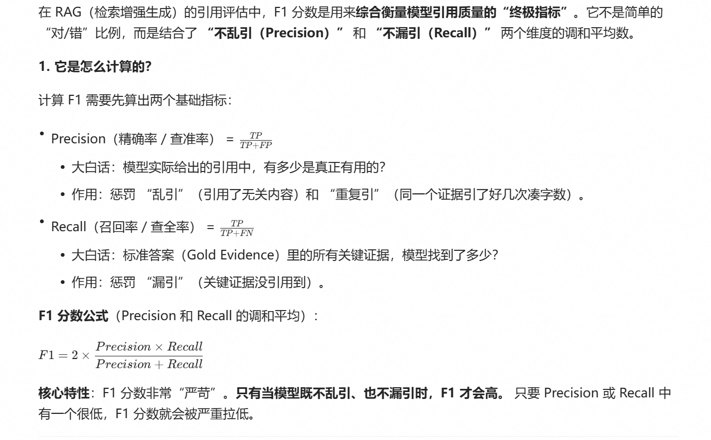

# 进度

- 完成论文PDF分析
- 完成论文chunk\_分块
- 完成chunk的embedding存入
- 完成提问-检索-重排-生成架构
- 实现一整套提问-回答系统
- 完成测试集设计
- 完成相应的评测脚本

---

# 遇到的困难

## **文本解析分块后, 在分页边缘的chunk对应的pageID不精确, 分页标记逻辑判断部分缺失**

&#x20;	采用代码修复文件进行修复已有的结果, 更改识别分页逻辑, 改写代码

<u>在跑这种大量代码时, 应该及时观察前几个生成结果的正确与否, 若是有错要及时改正,免得做了大量无用工作, 同时打补丁的工作不应该做太多, 导致代码越改越乱</u>

## PDF解析时间太长, 浪费很多时间

&#x20; 应该先做一步对于PDF解析的工作, 存下解析结果, 再通过不同chunk\_size操作进行分片, 模块化工作, 避免重复工作

## 存入向量数据库的时候, ChromaDB 写入时 HNSW 索引没有正确持久化。

&#x20; 注重路径问题, 有中文路径导致写入磁盘失败, 项目执行前, 一定要注意路径问题, 要保持路径全英文

## 依赖冲突问题

&#x20; 执行代码前可以用pip check进行检查, 并且尽量用比较稳定的版本, 最新版本不一定稳定与兼容其他依赖

<u>往后安装新的依赖后, 应该及时进行pip check的问题</u>

## **模型确实找到了正确的文档，也给出了正确的回答，但评测脚本的指标全为0, 认为没有检索到。**

可能是用于计算的阈值过高了, 将阈值从0.75调至0.7观察

## 模型回答有时候不带引用, 或者放在回答的上方

小模型生成不稳定, 强化指令, 采用硅基流动较大模型

## 人为打分较慢, 试试用大模型打分,但是效果并不好

改一下提示词, 先前提示词太不专业, 增加更多提示内容

## 改完提示词, 直接让大模型打分效果不佳, 只会采用0.8, 0.4等中等级别分数

采用RAGasF1(**Answer Correctness**)的评价标准, 但因为直接使用, 模型较难支持严格的json格式输出, 为了减小模型负担则进行简化, 让模型生成相应数字, 并带有保底机制, 若是仍然无法输出准确数字格式, 则采用语义相似度进行保底计算

*你是一个专业的学术评测员。请仔细对比【标准答案】和【模型回答】，按以下步骤分析：*

*【步骤1】拆解标准答案中的知识点（每个独立的观点/定义/方法算1个知识点）
【步骤2】对比模型回答，判断每个知识点的命中情况
【步骤3】输出三个数字（用逗号分隔）：*

*第一个数字 TP（命中）：模型回答中正确提到的知识点数量
第二个数字 FP（幻觉）：模型回答中与标准答案**事实冲突**的错误信息数量
第三个数字 FN（遗漏）：标准答案中有，但模型回答完全没提到的知识点数量*

*【重要规则】*

- *论文名称、引用来源不算FP*
- *模型回答比标准答案更详细（补充合理细节），只要不冲突，不算FP*
- *表述不同但意思相同，算TP不算FN*
- *只有**事实错误**或**完全捏造**才算FP*

*只输出三个数字，用逗号分隔，例如：3,0,1*

4

## 引用正确率难以准确计算

有一些问题并不只能在一段原文中找到答案, 从而采用语义相似度进行计算引用的相似度并不准确, 引用错的概率也会有所提升, 生成引用数与GoldEvidence片段数不一致的情况下, 很难标注哪一个GoldEvidence才是正确的答案,

比如多定义问题,A与B分别指什么, 此时GoldEvidence和引用很难对齐

**在正确率上也采用F1评价, 并且允许模型生成多个引用(promt)(最多两个, 若过多可能会导致模型生成性能下降)**

## 相似度阈值不好调

调低了,recall值全都很高, 调高了, recall满足值较少, 只能多做尝试

## 有一些输出只有引用, 没有回答, 且无法回答的答案较多

提示词写的不够好, 首先改掉告诉模型若能回答若不能回答这样的二选一选项, 这样模型会偏向于偷懒, 而较多生成无法回答等问题, 然后在警告等地方提出若上下文不足以回答问题才输出无法回答

*"你是一个学术论文问答助手。请严格基于提供的论文片段回答用户问题。\n\n"*

        *"【输出规则】（必须严格遵守）：\n\n"*

        *"- 第1步：直接输出准确、简洁的中文回答正文\n"*

        *"- 第2步：换行后，输出引用来源，格式：来自: \[论文名, 第X页, chunk\_id]\n"*

        *"- 引用最多写2个，只写回答中用到的核心来源\n\n"*

        *"【示例】：\n"*

        *"该模型通过引入安全对齐机制提升了鲁棒性。\n"*

        *"来自: \[SafeRAG, 第2页, 2025.acl-long.230\_SafeRAG\_chunk\_004]\n\n"*

        *"【严重警告】：\n"*

        *"- 若依据上下文不足以回答问题，仅输出：'无法回答此问题。'（无需引用） "*

        *"- 绝不能只输出引用而没有回答内容！\n"*

        *"- 绝不能无法回答还输出引用！\n"*

        *"- 违反上述规则将导致评测失败！"*