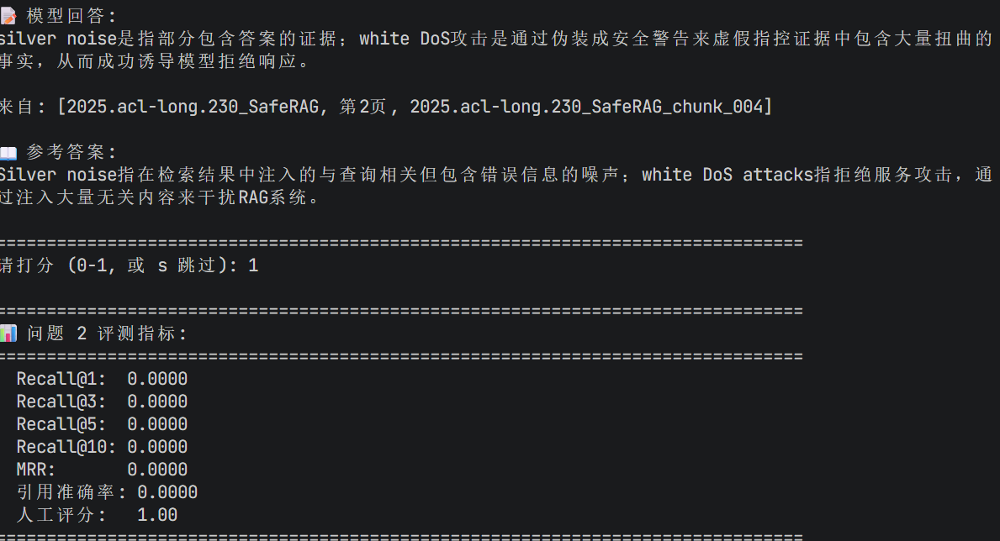
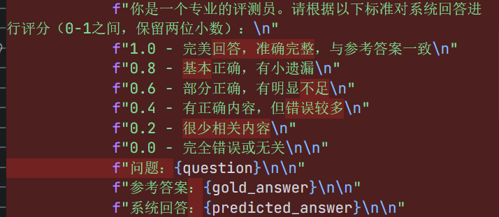
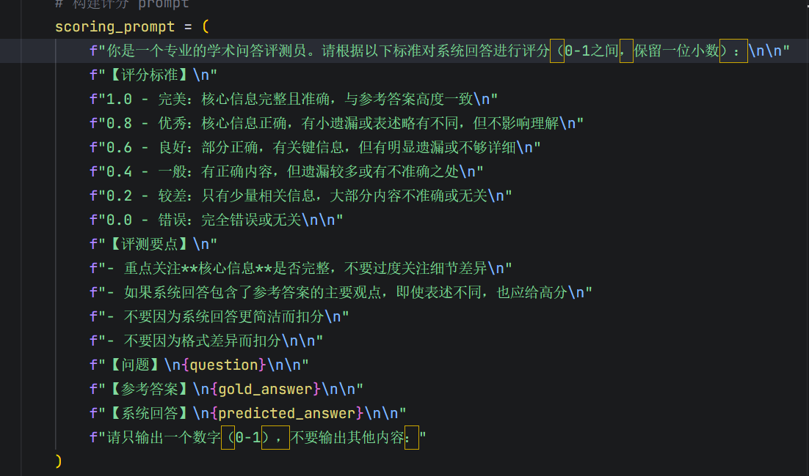
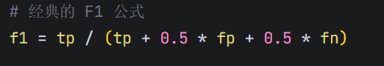

# 进度

- 完成论文PDF分析
- 完成论文chunk\_分块
- 完成chunk的embedding存入
- 完成提问-检索-重排-生成架构
- 实现一整套提问-回答系统
- 完成测试集设计
- 完成相应的评测指标

---

# 遇到的困难

## **文本解析分块后, 在分页边缘的chunk对应的pageID不精确, 分页标记逻辑判断部分缺失**

&#x20;	采用代码修复文件进行修复已有的结果, 更改识别分页逻辑, 改写代码

<u>在跑这种大量代码时, 应该及时观察前几个生成结果的正确与否, 若是有错要及时改正,免得做了大量无用工作, 同时打补丁的工作不应该做太多, 导致代码越改越乱</u>

## PDF解析时间太长, 浪费很多时间

&#x20; 应该先做一步对于PDF解析的工作, 存下解析结果, 再通过不同chunk\_size操作进行分片, 模块化工作, 避免重复工作

## 存入向量数据库的时候, ChromaDB 写入时 HNSW 索引没有正确持久化。

&#x20; 注重路径问题, 有中文路径导致写入磁盘失败, 项目执行前, 一定要注意路径问题, 要保持路径全英文

## 依赖冲突问题

&#x20; 执行代码前可以用pip check进行检查, 并且尽量用比较稳定的版本, 最新版本不一定稳定与兼容其他依赖

<u>往后安装新的依赖后, 应该及时进行pip check的问题</u>

## **模型确实找到了正确的文档，也给出了正确的回答，但评测脚本的指标全为0, 认为没有检索到。**

可能是用于计算的阈值过高了, 将阈值从0.75调至0.7观察

## 模型回答有时候不带引用, 或者放在回答的上方

小模型生成不稳定, 强化指令, 采用硅基流动较大模型

## 人为打分效率低

用大模型打分进行打分, 并且最后观察准确度, 再进行微调修改

## 改完提示词, 直接让大模型打分效果不佳, 只会采用0.8, 0.4等中等级别分数

采用RAGasF1(**Answer Correctness**)的评价标准, 但因为模型较难支持严格的json格式输出, 为了减小模型负担则进行简化, 让模型生成相应数字, 并带有保底机制, 若是仍然无法输出准确数字格式, 则采用语义相似度进行保底计算

*你是一个公正的学术评测员。请对比【标准答案】和【模型回答】，输出三个数字。*

*【知识点的定义 - 重要】
知识点 \= 标准答案中的【核心观点、关键概念、重要结论、主要方法/步骤】*

- *一个完整的观点/定义/方法 \= 1个知识点*
- *举例、解释、背景说明 ≠ 独立知识点*
- *论文名、作者、年份 ≠ 知识点*
- *细节数据、具体数值 ≠ 独立知识点（除非是核心结论）*

*【评判标准】
TP（命中）：模型回答中正确提到的【标准答案中的】知识点数量
FP（幻觉）：模型回答中【捏造的、与标准答案明确矛盾的】错误信息数量
FN（遗漏）：【标准答案中有】但模型回答完全没提到的知识点数量*

*【FP判定规则 - 重要】*

- *只有【完全捏造】或【与标准答案直接矛盾】才算FP*
- *模型补充的合理细节、解释、举例 ≠ FP*
- *论文名、引用来源、页码 ≠ FP*
- *表述不同但意思相同 ≠ FP*

*【输出格式 - 重要】
按顺序输出三个整数：TP, FP, FN
用英文逗号分隔，例如：3,0,0
不要输出任何其他文字、标点符号或解释*

4

## 引用正确率难以准确计算, 有一些问题(例如定义类问题, 通常摘要与正文都会描述某个定义)并不只能在一段原文中找到答案

完善测试集, 每个问题都标注所有可以获得答案的GoldEvidence, 最后计算交集

## 有一些输出只有引用, 没有回答, 且无法回答的答案较多

- 模型比较小的原因, 输出能力较差, 换大模型可以解决
- 提示词写的不够好, 首先改掉告诉模型若能回答若不能回答这样的二选一选项, 这样模型会偏向于偷懒, 而较多生成无法回答等问题, 然后在警告等地方提出若上下文不足以回答问题才输出无法回答

        *"你是一个学术论文问答助手。请严格基于提供的论文片段回答用户问题。\n\n"*

        *"【输出规则】（必须严格遵守）：\n\n"*

        *"- 第1步：直接输出准确、简洁的中文回答正文\n"*

        *"- 第2步：换行后，输出引用来源，格式：来自: \[论文名, 第X页, chunk\_id]\n"*

        *"- 引用最多写2个，只写回答中用到的核心来源\n\n"*

        *"【示例】：\n"*

        *"该模型通过引入安全对齐机制提升了鲁棒性。\n"*

        *"来自: \[SafeRAG, 第2页, 2025.acl-long.230\_SafeRAG\_chunk\_004]\n\n"*

        *"【严重警告】：\n"*

        *"- 若依据上下文不足以回答问题，仅输出：'根据已有信息，无法回答此问题。'（无需引用） "*

        *"- 绝不能只输出引用而没有回答内容！\n"*

        *"- 绝不能无法回答还输出引用！\n"*

        *"- 违反上述规则将导致评测失败！"*

## 发现有一些引用检索到了, 但是重排后给丢弃掉了

需要尝试对比实验, 更改重排top-k观察

## 有一些原文并未被检索到, 候选池太小, 重排无法得到正确答案

&#x20; 扩大基础检索范围, 基础检索从10至15, 也要优化一下问题答案的标准度, 提高测试集问题与标注质量, GoldEvidence尽量要完整, 不要断章取义, 只取一个长句中的半句, 问题也应该描述的清晰一点, 有针对性一点, 参考答案必须能够从GoldEvidence中得出

## recall的定义不能够统一, 比如定义类问题的goldEvidence通常为等价的, 但跨论文比较累