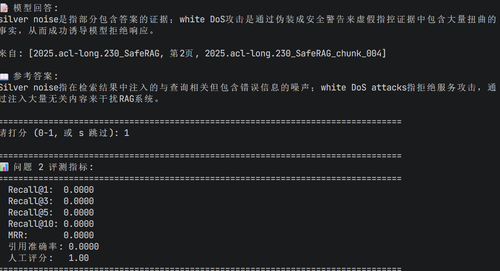
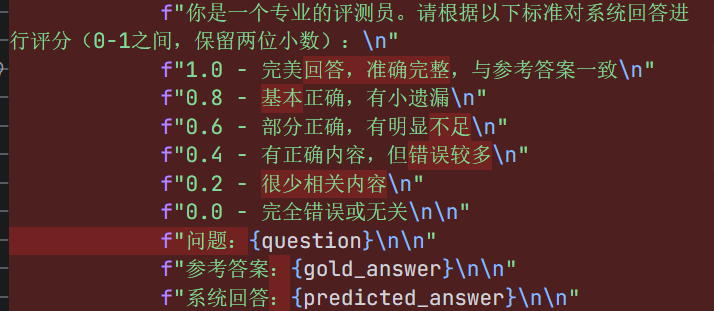
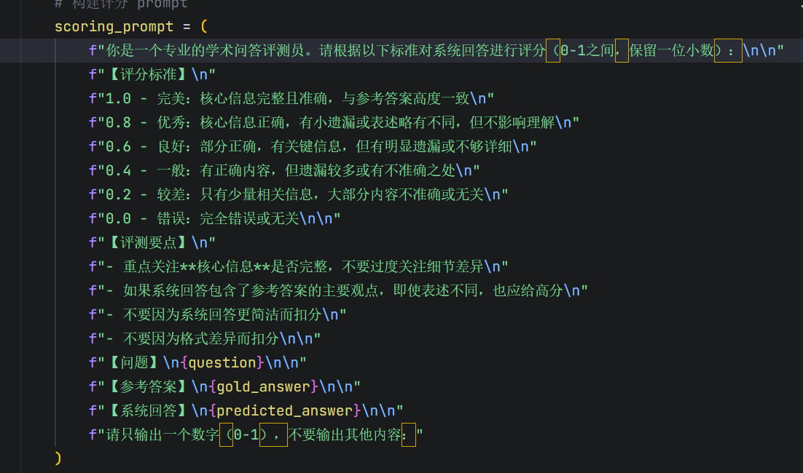
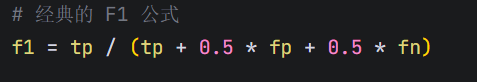

# 进度

- 完成论文PDF分析
- 完成论文chunk\_分块
- 完成chunk的embedding存入
- 完成提问-检索-重排-生成架构
- 实现一整套提问-回答系统
- 完成测试集设计
- 完成相应的评测指标
- 查看bad case, 优化RAG系统
- 调相似度阈值参数
- 优化模型提示词

---

# 遇到的困难

## **1.文本解析分块后, 在分页边缘的chunk对应的pageID不精确, 分页标记逻辑判断部分缺失**

&#x20;	采用代码修复文件进行修复已有的结果, 更改识别分页逻辑, 改写代码

<u>在跑这种大量代码时, 应该及时观察前几个生成结果的正确与否, 若是有错要及时改正,免得做了大量无用工作, 同时打补丁的工作不应该做太多, 导致代码越改越乱</u>

## 2.PDF解析时间太长, 浪费很多时间

&#x20; 应该先做一步对于PDF解析的工作, 存下解析结果, 再通过不同chunk\_size操作进行分片, 模块化工作, 避免重复工作

## 3.存入向量数据库的时候, ChromaDB 写入时 HNSW 索引没有正确持久化。

&#x20; 注重路径问题, 有中文路径导致写入磁盘失败, 项目执行前, 一定要注意路径问题, 要保持路径全英文

## 4.依赖冲突问题

&#x20; 执行代码前可以用pip check进行检查, 并且尽量用比较稳定的版本, 最新版本不一定稳定与兼容其他依赖

<u>往后安装新的依赖后, 应该及时进行pip check的问题</u>

## **5.模型确实找到了正确的文档，也给出了正确的回答，但评测脚本的指标全为0, 评为没有检索到。**

可能是用于计算的阈值过高了, 将阈值从0.75调至0.7观察

## 6.模型回答有时候不带引用, 或者放在回答的上方

小模型生成不稳定, 强化指令, 采用硅基流动较大模型

## 7.人为打分效率低

用大模型打分进行打分, 并且最后观察准确度, 再进行微调修改

## 8.改完提示词, 直接让大模型打分效果不佳, 只会采用0.8, 0.4等中等级别分数

采用RAGasF1(**Answer Correctness**)的评价标准, 但因为模型较难支持严格的json格式输出, 为了减小模型负担则进行简化, 让模型生成相应数字, 并带有保底机制, 若是仍然无法输出准确数字格式, 则采用语义相似度进行保底计算

*你是一个公正的学术评测员。请对比【标准答案】和【模型回答】，输出三个数字。*

*【知识点的定义 - 重要】
知识点 \= 标准答案中的【核心观点、关键概念、重要结论、主要方法/步骤】*

- *一个完整的观点/定义/方法 \= 1个知识点*
- *举例、解释、背景说明 ≠ 独立知识点*
- *论文名、作者、年份 ≠ 知识点*
- *细节数据、具体数值 ≠ 独立知识点（除非是核心结论）*

*【评判标准】
TP（命中）：模型回答中正确提到的【标准答案中的】知识点数量
FP（幻觉）：模型回答中【捏造的、与标准答案明确矛盾的】错误信息数量
FN（遗漏）：【标准答案中有】但模型回答完全没提到的知识点数量*

*【FP判定规则 - 重要】*

- *只有【完全捏造】或【与标准答案直接矛盾】才算FP*
- *模型补充的合理细节、解释、举例 ≠ FP*
- *论文名、引用来源、页码 ≠ FP*
- *表述不同但意思相同 ≠ FP*

*【输出格式 - 重要】
按顺序输出三个整数：TP, FP, FN
用英文逗号分隔，例如：3,0,0
不要输出任何其他文字、标点符号或解释*

4

## 9.引用正确率难以准确计算, 有一些问题(例如定义类问题, 通常摘要与正文都会描述某个定义)并不只能在一段原文中找到答案

完善测试集, 每个问题都标注所有可以获得答案的GoldEvidence, 最后计算交集

## 10.有一些输出只有引用, 没有回答, 且无法回答的答案较多

- 模型比较小的原因, 输出能力较差, 换大模型可以解决
- 提示词写的不够好, 首先改掉告诉模型若能回答若不能回答这样的二选一选项, 这样模型会偏向于偷懒, 而较多生成无法回答等问题, 然后在警告等地方提出若上下文不足以回答问题才输出无法回答

        *"你是一个学术论文问答助手。请严格基于提供的论文片段回答用户问题。\n\n"*

        *"【输出规则】（必须严格遵守）：\n\n"*

        *"- 第1步：直接输出准确、简洁的中文回答正文\n"*

        *"- 第2步：换行后，输出引用来源，格式：来自: \[论文名, 第X页, chunk\_id]\n"*

        *"- 引用最多写2个，只写回答中用到的核心来源\n\n"*

        *"【示例】：\n"*

        *"该模型通过引入安全对齐机制提升了鲁棒性。\n"*

        *"来自: \[SafeRAG, 第2页, 2025.acl-long.230\_SafeRAG\_chunk\_004]\n\n"*

        *"【严重警告】：\n"*

        *"- 若依据上下文不足以回答问题，仅输出：'根据已有信息，无法回答此问题。'（无需引用） "*

        *"- 绝不能只输出引用而没有回答内容！\n"*

        *"- 绝不能无法回答还输出引用！\n"*

        *"- 违反上述规则将导致评测失败！"*

## 11.发现有一些引用检索到了, 但是重排后给丢弃掉了

需要尝试对比实验, 更改重排top-k观察

## 12.有一些原文并未被检索到, 候选池太小, 重排无法得到正确答案

&#x20; 扩大基础检索范围, 基础检索从10至15, 也要优化一下问题答案的标准度, 提高测试集问题与标注质量, GoldEvidence尽量要完整, 不要断章取义, 只取一个长句中的半句, 问题也应该描述的清晰一点, 有针对性一点, 参考答案必须能够从GoldEvidence中得出

## 13.recall的定义不能够统一, 比如定义类问题的goldEvidence通常为等价的, 但跨论文比较类的goldEvidence, 两篇论文的GoldEvidence不一样, 且数量也不一定统一

采用hit@k来代替recall@k的计算, 主要计算检索成功率, 对于检索不完全等问题, 可根据recall@k与回复准确率来联合判断, 若检索成功率高但是回复不准确, 即可以判断为片面检索

## 14.recall和引用准确率不高, 有一些引用生成正确了, 但是语义相似度匹配却不过关, 原因是chunk\_size是固定的, 而GoldEvidence长短不一, 有一些比较精炼, 有一些又比较详细

采用混合匹配策略, 同时计算整 chunk 相似度和句子级最大相似度，取两者中的最大值。这样无论 gold 长短，都能找到最佳匹配。因为更加精确了, 同时提高相似度阈值

## 15.用ai辅助编码, 一定要ai在终端输出调试的信息, 方便自己发现问题, 修改代码

## 16. 对于提及论文核心概念时, 模型生成引用时易生成chunk0, 而chunk0通常包含作者等与问题无关信息, 最后计算的语义相似度不够, 导致引用准确率下降

分chunk前, 先对文本进行清洗, 去除标题、作者、机构等元信息, 只保留正文

## 17.对于提的问题, 如果过于泛的话, 模型可能依据上下文无法回答

优化提的问题, 更加精准一些, 针对性更高一些, 比如跨论文比较类问题, 如果提问直接比较的话, 可能由于信息过于分散, 上下文依赖过多, 模型难以回答, 可以尝试扩大top-k来解决, 但优化问题, 使得问题更有针对性会比较好

## 18.跨论文比较类问题与方法细节类问题表现较为糟糕

首先优化跨论文比较类问题的提问精准度, 其次原因可能出在这两类问题比较难, 需要的上下文信息较多

## 19.对于定义类问题, 通常参考答案都是非常简洁的, 但是模型生成回复的时候会生成一些多的解析/步骤等, 降低了回复准确率

增加提示词限制, 对于定义类问题, 要简洁回复

*"- 你的任务是基于上下文回答问题。如果问题要求定义某个术语，请仅输出该术语的核心定义，使用一句话，不要包含任何例子、构建方法、步骤或额外解释。\n"*

## 20.跨论文比较类问题, recall值高, 但是回复和引用正确率低, 重排序被其中一个论文为主导, 无法获取另一论文的上下文, 导致回复正确率低

~~采用检索集中度论文组进行重排, 先对检索中的不同论文进行分组, 假如某一篇论文的检索中占据了一定的比例(设为50%)以上, 即可认为此为单论文问题, 直接按重排分数排行, 若非如此, 可认为是多论文问题, 对检索集中度论文组的top-2(参数, 可调参, 设为top-3, 跨论文比较类都为双论文比较问题, 所以没必要更多)论文组进行轮询重排, 依次取出每一组中的最高分以作返回, 考虑边界情况, 假如top-2轮询后仍然不够重排top-k数量的话, 则从top-3论文组补充, 以此类推~~

<u>~~即使某一个单篇论文问题该论文召回数不及阈值, 也大概率是top1的论文组, 所以也能保证能够召回答案相关上下文, 虽然这样不会降低recall@3, 但是会一定程度上降低了mrr, 本来可以在第二位命中, 可能会导致只能在第三位命中了~~</u>

#### ~~对于这个问题, 还有一个衍生问题, 假如一个问题, 检索到的对应论文很少, 但是对应分数相当高, 并且该检索是正确的怎么处理?~~

~~采用多一重判断逻辑, 先进行top1, 2分数的差距比较, 假设检索第一名和第二名差距检索分数差距大, 也可以判断为单篇论文问题, 因为检索到了一个相当准确的上下文, 如果此时还采用多篇比较类问题的话, 可能会导致这个文档因为论文总体检索数量少而被丢弃~~

*~~效果依然很差, 大多数跨论文比较类的问题仍然是以一个论文为占主导定位, 基本都是判定为单篇问题, 如果阈值设为60及以上, 反而很多单篇问题被判定为多论文问题~~*

采用MMR多样性重排序, 综合相关性与多样性问题, 平衡单篇与多篇论文问题

## 21. 检索到了但重排分数低, rerank策略不够好

1.优化rerank提示词, 加强定义的提示, 不只是注重关键词的精度匹配 2.假如MMR多样性重排序, 兼顾上下文相关性与多样性, 大幅增加了所有指标(关键优化)

## 22.引用准确率纯语义相似度计算, 会有一点误差, 其中跨论文比较类问题多一些

手动微调指标, 最终结果有0.02\~0.05的浮动

##